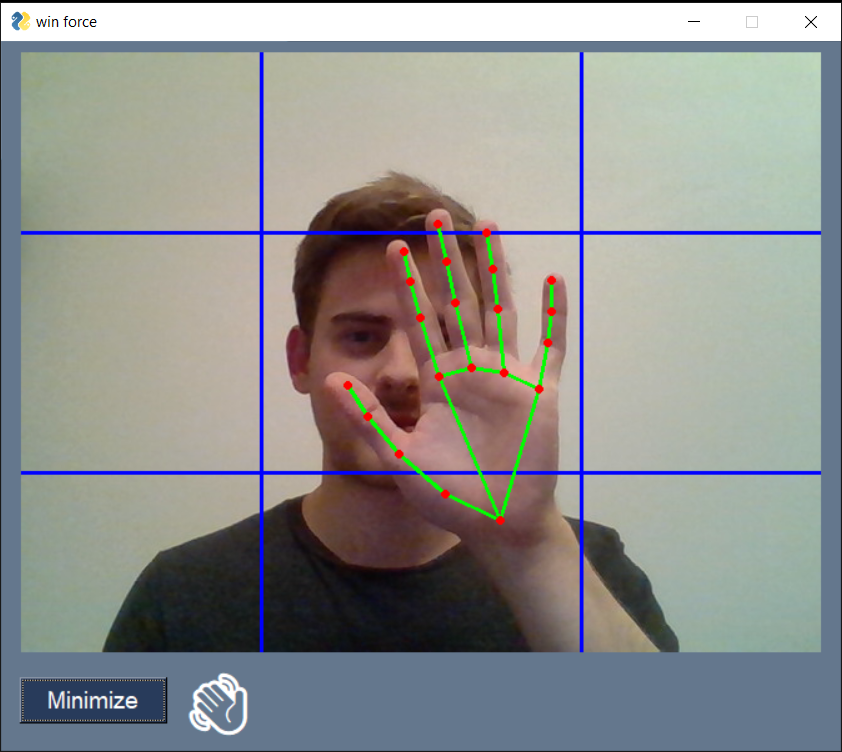
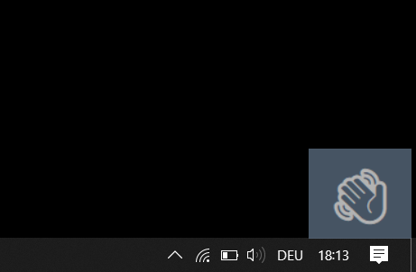

# WinForce
With WinForce you can move your windows on your screen like a Jedi. It uses to [Google MediaPipe](https://github.com/google/mediapipe) detect the hand, swipe gestures to the left, right, up or down move the active window accordingly - similar to winkey + arrowkeys.  
This project was created for the course *Building Interaction Inferfaces at TU Wien*.

## Dependencies
- the application only works on Windows
- other platforms are supported, but cannot move windows
- Python 3.8
- [Autohotkey](https://www.autohotkey.com/)
- Python packages
  - PySimpleGUI
  - ahk
  - mediapipe
  - opencv-python

## Install dependencies
- install [Autohotkey](https://www.autohotkey.com/) [Windows only]
- pip
  - [optional] create virtual environment and activate it
  - make sure you have python 3.8 installed
  - run `pip install -r requirements.txt`
- conda
  - run `conda env create --name WinForce --file=environment.yml`
  - run `conda activate WinForce`

## Run the Application
- run `python win_force.py`
- click on 'minimize' to close the big window, in the lower right corner the emoji indicator appears
- a click on the miniature window in the lower right corner will open the big window again
- **to move a window, it has to be focused first (e.g. by clicking on the window)**

Application screen with displayed camera input  | Miniature indicator with application running in the background
--|--
  |  

## Detected gestures
- move your hand to the middle of the x or y axis
- after a sound is played and/or the hand emoji is present in the emoji indicator
  - move your hand up or down: the focused window is snapped up or down (analog to `windows + UP/DOWN` on the keyboard)
  - move your hand left or right: the focused window is snapped to the left or right (analog to `windows + LEFT/RIGHT` on the keyboard)
  - form a fist gesture to cancel the current detection of your hand

## Visual & acoustic Feedback
Depending on the detected action, WinForce will give you visual and acoustic feedback. The visual feedback (as emoji) can be seen in both the large and the miniature window. Hand detection along the middles are mapped to sounds. On Windows we use the pre-installed Windows sounds, on any other OS we use the package *beepy*. you can disable the acoustic feedback in the main window of the application.

Action  | Visual Feedback  |  Acoustic Feedback (Windows) | Acoustic Feedback (other OS)
--|---|--|--
WinForce is waiting for input  | :eyes:  |  --
Hand detected in the middle of the x-axis  | :wave:  |  `chimes.wav` | `beepy: sound 1`
Hand detected in the middle on the y-axis  |  :wave: |  `ding.wav` | `beepy: sound 4`
Hand moved to the right  | :arrow_right:  | --  |  --
Hand moved to the left  | :arrow_left:  |  --  |  --
Hand moved up  | :arrow_up:  | --  | --  
Hand moved down  | :arrow_down:  | --  | --  
Cancel detection (Fist gesture)  | :x:   | `chord.wav`  | `beepy: sound 3`  
